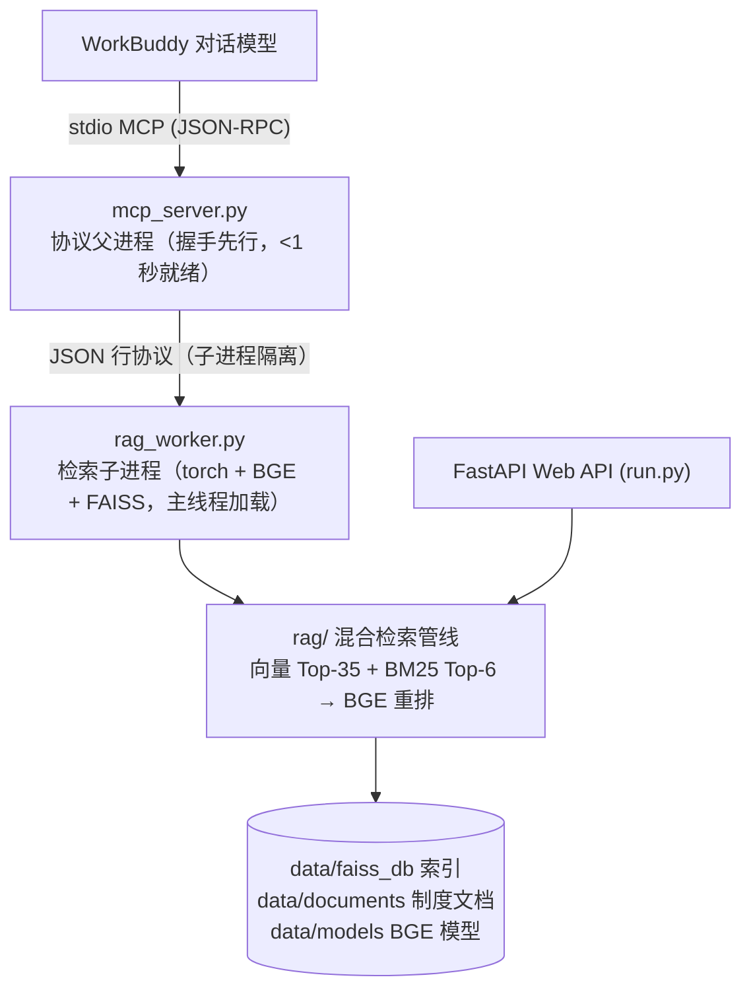

# 企业本地知识库 MCP 工具 (kb-tool)

面向 WorkBuddy 的**纯本地企业知识库检索工具**：一条 stdio MCP 配置即可接入，
知识库文档、FAISS 索引与 BGE 嵌入模型全部存于本机 `data/` 目录，数据不上云。
同时保留一套 **FastAPI Web API**（`run.py`），可作为独立问答服务运行。

> 新电脑部署见 `../部署指南.md`；MCP 接入优化全过程与踩坑复盘见 `优化过程报告.html`。

---

## 🧩 双形态架构



**为什么拆成父子两个进程？** Windows 上 torch/sentence_transformers 等重库若在
非主线程 import 会触发 Loader Lock 死锁。因此协议父进程只加载 FastMCP（秒级握手，
WorkBuddy 首问即可看到工具），重型检索栈全部放在 `rag_worker.py` 子进程的**主线程**
加载；子进程崩溃时父进程自动重启并强杀超时请求。

---

## 🔧 WorkBuddy 内可用的 3 个 MCP 工具

| 工具 | 功能 |
|---|---|
| `search_knowledge_base` | 混合语义检索（FAISS 向量 + BM25 关键词 + BGE 重排），返回命中文档段落与来源 |
| `list_knowledge_documents` | 列出所有已收录文档 |
| `add_document_to_knowledge` | 新增并索引文档（传本地绝对路径，支持 pdf/docx/md/txt） |

在 WorkBuddy 中直接自然语言提问即可（"公司年假制度是什么？""差旅报销标准？"），
对话模型经 Skill 路标与用户记忆规则自动路由到本工具。

---

## 🚀 快速开始（WorkBuddy 一键接入，推荐）

进入本项目文件夹，**双击 `一键安装到WorkBuddy.bat`**（等效命令
`python install_to_workbuddy.py`），脚本幂等可重复运行，自动完成：

1. 创建/修复 `.venv` 并安装依赖（含 torch/faiss，首次约 10~30 分钟，需联网）
2. 将 `enterprise-knowledge-base` 合并注册进 `~/.workbuddy/mcp.json`（不动其他服务）
3. 部署路由 Skill（`deploy/skills/enterprise-kb-query` → `~/.workbuddy/skills/`）
4. 向 `~/.workbuddy/MEMORY.md` 追加查询路由规则（带标记块，可随项目升级自动更新）
5. **端到端体检**：真实启动本 MCP 服务 → 协议握手计时 → 列工具 → 实际检索
   "年假制度"一次；并检查 WorkBuddy 信任状态

可选参数：`--mcp-only` 只更新 mcp.json；`--no-verify` 跳过体检。

> `一键安装到WorkBuddy.bat` 的行为：`.venv` 已就绪时打开图形化向导
> （`gui_installer.py`，日常注入/卸载管理）；`.venv` 缺失（首次部署/换电脑）时
> 自动改走上面的全量安装脚本，无需手动区分。

安装完成后唯一的手动步骤：WorkBuddy 连接器管理页 → 自定义连接器 →
对 `enterprise-knowledge-base` 点一次「信任」（或重启 WorkBuddy）。

---

## 🌐 可选：独立 Web API 模式

```bash
双击 一键启动.bat        # 自举创建 .venv、安装依赖、拉起 FastAPI 服务
# 或
.venv\Scripts\python run.py
```

- `POST /ask` 问答、`POST /stream` SSE 流式问答，以及文档管理与评估接口（`app/routes/`）
- 本模式为**纯后端 API**（供自有前端/系统集成调用），项目不内置 Web 界面
- `.env`：从 `.env.example` 复制；纯本地检索模式云端 Key 可留空

---

## 📂 项目目录结构

```
kb-tool/
├── mcp_server.py                  # [MCP] stdio 协议父进程（FastMCP，握手先行 + 子进程看护）
├── rag_worker.py                  # [MCP] 检索子进程（torch/BGE 主线程加载，JSON 行协议）
├── install_to_workbuddy.py        # [MCP] WorkBuddy 一键安装脚本（venv/注册/Skill/记忆/体检）
├── gui_installer.py               # [MCP] 图形化安装向导（bat 在 venv 就绪时调用）
├── deploy/skills/enterprise-kb-query/SKILL.md   # [MCP] 随项目分发的对话路由路标
├── 一键安装到WorkBuddy.bat        # [MCP] 双击入口（首次全量安装 / 日常 GUI 向导）
├── 优化过程报告.html              # MCP 调用链优化复盘（含流程图与踩坑记录）
│
├── run.py                         # [Web] FastAPI 服务启动入口 (Uvicorn)
├── start.bat / 一键启动.bat       # [Web] 自举环境并拉起 API 服务
├── 一键安装与修复环境.bat         # [Web] 依赖环境安装/修复
├── config.py / .env.example       # 配置与密钥范本（Firecrawl / DeepSeek 可选）
│
├── app/                           # [Web] FastAPI 应用层
│   ├── routes/ask.py              #   问答 / SSE 流式 / 模型探测 / 评估路由
│   └── routes/documents.py        #   文档入库与管理路由
│
├── rag/                           # 核心检索与智能体逻辑层（MCP 与 Web 共用）
│   ├── retriever.py               #   混合检索（FAISS Top-35 + BM25 Top-6 → BGE 重排）
│   ├── vector_store.py            #   FAISS 向量库增量构建与损坏自愈
│   ├── embeddings.py              #   BGE 嵌入惰性加载器
│   ├── splitter.py / loader.py    #   文档切分与多格式解析（父子块扩展）
│   ├── dedup.py / rewriter.py / reranker.py
│   ├── router.py                  #   意图路由（检索直连 / 摘要 / Agent）
│   ├── agent.py / chain.py / llm.py / prompts.py / memory.py
│   └── tools/                     #   calculator / summary / web_search / rag_tool
│
├── utils/                         # 日志 / 噪声抑制 / 容错
├── evaluator/                     # 检索与生成质量自动化评测
├── data/
│   ├── documents/                 # 知识库文档（制度 md/docx/txt）★随项目整体拷贝
│   ├── faiss_db/                  # FAISS 索引                        ★随项目整体拷贝
│   └── models/                    # BGE 嵌入模型                      ★随项目整体拷贝
└── requirements.txt               # 依赖清单（固定 mcp>=1.0.0,<2）
```

---

## ⚠️ 注意事项

- `data/`（文档 + 索引 + BGE 模型）必须随项目整体拷贝，漏拷则检索不可用
- `.venv` 不可跨机使用；安装脚本检测到损坏会自动删除重建
- 纯本地检索不需要 LM Studio；Web 模式的生成环节若未配置云端 Key，需启动 LM Studio
- 依赖版本约束 `mcp>=1.0.0,<2`（FastMCP 2.x 改名，勿升级）
