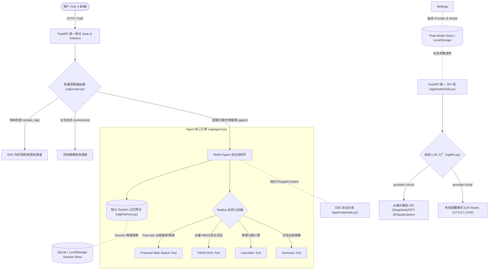

# 面向异构技术文档的自适应容灾型问答 Agent 协同系统 (v3.5)

基于 LangChain + DeepSeek / LM Studio + Firecrawl + FAISS + Vue 3 的企业级智能问答 Agent 协同系统。项目旨在解决静态知识库（RAG）检索中**无法处理逻辑算术运算、缺乏互联网时效性扩展、搜索反爬/死循环、端云模型切换困难、思维链空白等待、模型上下文截断丢失以及会话历史在动态环境部署易混淆崩溃**等工程痛点。

---

## 🛠️ 项目技术亮点与核心架构 (v3.5 全景)

本系统由**前端全景大盘 (Vue 3 + Pinia)、端云模型管理中心 (Settings)、前置分类网关 (Router)、动态 LLM 实例化工厂 (Dynamic Factory)、ReAct 协同决策环 (Firecrawl/LangChain)、自适应记忆网关 (Session Isolation)** 等核心模块组成：



---

## 🔥 v3.5 核心重构与最新升级特性

1. **端云混合模型管理大盘 (Multi-Provider Hybrid Architecture)**：
   - **云端 API 模式 (Cloud API)**：对接主流云端大模型 API（支持 `deepseek-chat` / `deepseek-reasoner` / `gpt-4o` / `claude-3-5-sonnet` / `qwen-max` 等），具备高并发推理能力与弹性拓展能力。
   - **本地端侧部署模式 (Local Mode)**：基于本地硬件平台纯离线推理（支持 `LM Studio` / `qwen3.8-27b` 等），数据 100% 离线隐私安全，零 Token 运营成本。
   - **状态自动感测**：内置 `http://127.0.0.1:1234/v1/models` 健康检查与模型自动发现机制，前端自动感知拉取本地已加载的模型列表。

2. **全链路动态 LLM 工厂架构 (Dynamic LLM Factory Architecture)**：
   - 彻底解耦静态 LLM 硬绑定，在 `rag/llm.py`、`rag/chain.py` 与 `rag/agent.py` 中实现了 `huode_dongtai_llm()`、`create_qa_chain()` 与 `create_dynamic_agent_executor()` 动态工厂，支持运行时根据前端请求实时构建适配的链与 Agent 执行器。

3. **动态系统上下文注入与自愈兜底 (Runtime Context Injection & Soft Fallback)**：
   - 在底层系统提示词中自动注入后端当前的真实运行模式与模型标识，解决大模型呆板套话与空转问题。
   - 实现知识库未命中时的通用 LLM 知识无缝自愈回答，防止机械式输出“未找到”。

4. **大模型思维链 (Chain of Thought) 实时流式传输与状态机重组渲染**：
   - **全链路底层支持**：打通 `langchain_openai` 与本地推理引擎（LM Studio / Qwen / DeepSeek-R1 / vLLM），底层捕获 `delta.reasoning_content`，避免长推理模型长达数十秒的空白等待。
   - **状态机碎片重组算法 (`cleanThought`)**：彻底攻克流式 Token 碎片断裂导致的孤立单字、单数字（如 `3\n8\n0\n元\n/\n晚`）垂直碎裂排版，实现无缝连贯自然段落。
   - **动态折叠与富文本排版**：思考中实时呈现秒级计时与淡蓝光晕，完成后自动收起为 `✨ 已深度思考 (用时 X.X 秒)`，支持点击随时复盘。

5. **上下文截断自适应检测与一键无缝续写 (Context Truncation Alert & Continuation)**：
   - **双轨截断检测**：后端基于 `finish_reason == 'length'` 标识实时发出截断信号；前端针对未闭合公式/代码/括号进行启发式智能容灾检测。
   - **一键连贯续写**：检测到截断时，底部醒目弹出警告条并提供“继续生成”一键续写操作，免除用户重新组织语言的繁琐交互。

6. **会话物理隔离与智能自动恢复 (Smart Session Persistence)**：
   - 每次对话拥有独立隔离的 `session_id` 与锁机制；在刷新网页或服务重启后，系统默认智能恢复用户最近一次活跃会话，保障连续业务体验。

7. **智能滚动防护与浮动快捷回到底部 (Smart Scroll Guard & Float Button)**：
   - 用户上滑查阅历史记录时，自动抑制新文字吐出引起的强行滚到底部；
   - 距离底部超过阈值时，右下角柔和呈现悬浮快捷按钮，点击平滑触底并伴随生成中脉冲动效。

8. **高保真 LaTeX 数学公式与极简现代输入交互 (KaTeX Typography & Minimal UI)**：
   - 深度集成 KaTeX 原生排版引擎，支持块级与行内数学公式美观渲染；
   - 移除底部多余的“搜索模式”和“流式输出”手动开关，默认锁定最佳实践（BM25+BGE 混合检索与流畅流式思维链），界面极简清爽。

---

## 📂 项目目录结构

```
企业本地知识库/
├── run.py                         # FastAPI 服务启动入口 (Uvicorn)
├── config.py                      # 环境变量读取 (Firecrawl / DeepSeek / 路径预检)
├── README.md                      # [v3.5 UPGRADED] 项目最新架构与使用说明文档
├── requirements.txt               # 第三方依赖库列表 (已包含 firecrawl-py / langchain)
├── .env / .env.example            # 环境变量配置（.env.example 为脱敏范本）
├── start.bat / 一键启动.bat       # 自举环境并拉起服务
├── 一键安装与修复环境.bat         # 依赖环境安装/修复
├── test_agent.py                  # Agent 独立调试脚本
│
├── app/                           # FastAPI 服务应用层
│   ├── main.py                    # FastAPI 实例配置与前端 dist 静态目录挂载
│   ├── schemas.py                 # Pydantic 接口入参校验模型 (支持 provider & model_name 校验)
│   └── routes/
│       ├── ask.py                 # 问答/流式 SSE /本地模型探测/评估结果全套路由
│       └── documents.py           # 文档入库与管理路由
│
├── frontend/                      # [v3.5 UPGRADED] Vue 3 + Pinia + Element Plus 前端源码
│   ├── dist/                      # [v3.5] 预打包好的前端静态资源产物 (由 run.py 统一托管，开箱即用)
│   ├── src/
│   │   ├── api/                   # 接口请求封装 (含 SSE 流解析、端云模式透传)
│   │   ├── stores/                # Pinia 状态中心 (chat.js 记忆隔离与恢复, model.js 端云配置)
│   │   ├── views/                 # 页面视图 (ChatView, HistoryView, EvaluationView, SettingsView 模型管理)
│   │   ├── utils/                 # 工具函数 (markdown.js 状态机重组算法、KaTeX 数学排版)
│   │   └── components/            # DeepSeek 思考流卡片、智能滚动回底按钮、MessageBubble
│   ├── package.json
│   └── vite.config.js             # 前端构建配置 (二次开发可用: cd frontend && npm run build)
│
├── rag/                           # 核心算法与智能体逻辑层
│   ├── agent.py                   # [v3.0] 动态 ReAct Agent 装配中心与 Strict Format Protocol 防死锁
│   ├── memory.py                  # Session 级别独占记忆管理器
│   ├── router.py                  # 前置轻量级 LLM 意图路由器 (快慢道分离)
│   ├── llm.py                     # [v3.0] 动态端云 LLM 实例化工厂方法
│   ├── chain.py                   # [v3.0] 动态组装 QA 问答链
│   ├── prompts.py                 # [v3.0] 动态系统运行上下文注入与软提示词模板
│   ├── embeddings.py              # BGE Embedding 惰性延迟加载器
│   ├── vector_store.py            # FAISS 向量库增量构建与损坏自愈
│   ├── retriever.py               # 混合检索 (语义 + BM25 并行重排)
│   ├── reranker.py                # BGE-Reranker 重排器
│   ├── splitter.py / loader.py    # 文档切分与多格式解析 (父子块扩展)
│   ├── dedup.py / rewriter.py     # 召回去重与查询改写
│   └── tools/                     # 协同工具箱
│       ├── web_search_tool.py     # Firecrawl 云端主搜 + 本地降级 + 物理熔断器
│       ├── rag_tool.py            # 知识库召回封装 (xiangliang_and_bm25_zhaohui)
│       ├── calculator_tool.py     # 沙箱计算器
│       └── summary_tool.py        # 全局摘要生成器
│
├── utils/                         # 日志 / 噪声抑制 / 容错
├── evaluator/                     # 自动化全链路评测框架
│   ├── test_dataset.py            # 黄金测试数据集自动生成器
│   └── evaluator.py               # 检索层/工程层/生成质量 3 维评估管道
└── data/
    ├── documents/                 # 知识库文档源
    ├── faiss_db/                  # FAISS 持久化索引
    └── models/                    # 本地 BGE 模型
```

---

## ⚡ 核心协同工具箱 (Toolbox v3.0)

1. **`wangye_sousuo_tool` / `bing_web_search_tool` / `baidu_web_search_tool` (Firecrawl 驱动)**：
   * **主搜索引擎**：接入工业级 **Firecrawl 云端 search API** (`https://api.firecrawl.dev/v1/search`)，天然提取高纯度 Markdown 正文，100% 清除 ICP 备案、广告与导航噪声。
   * **后备与熔断器**：当网络波动时无缝降级至通用抽取器，并植入 **单轮调用物理熔断器 (`_check_and_increment_call`)**，同一个会话被调用超 2 次强行熔断，彻底斩断 ReAct 死循环。
2. **`xiangliang_and_bm25_zhaohui` (FAISS RAG Tool)**：
   * 本地 FAISS (稠密向量，Top-35) + BM25 (稀疏关键词，Top-6) 混合召回，经过 BGE-Reranker 重排截取 Top-15。支持父子块扩展机制（300 Tokens 子块检索命中自动扩展为 800 Tokens 父块）。
3. **`jisuanqi_tool` (Physical Sandbox Calculator)**：
   * 限制表达式 100 字符内，去除 `__builtins__` 的物理隔离安全沙箱计算器，解决大模型高维乘法与字节计算幻觉。
4. **`wendang_zhaiyao_tool` (Summary Tool)**：
   * 全局检索特定主题文档并生成结构化大纲与 Markdown 摘要。

---

## 🚀 快速开始

### 1. 配置环境变量
在项目根目录下复制 `.env.example` 为 `.env` 并填入密钥（如使用纯本地部署模式，云端 Key 可留空）：
```ini
DEEPSEEK_API_KEY='your_deepseek_api_key_here'      # DeepSeek 密钥 (可选)
FIRECRAWL_API_KEY='your_firecrawl_api_key_here'                 # Firecrawl 密钥 (可选)
DEEPSEEK_API_URL='https://api.deepseek.com'         # API 基址
LOCAL_LLM_URL='http://127.0.0.1:1234/v1'           # 本地模型服务地址 (默认 LM Studio)
LOCAL_DB_PATH='./data/faiss_db'                     # FAISS 持久化目录
YUAN_SUCAI_PATH='./data/documents'                 # 文档目录
```

### 2. 前置条件与自举启动说明

- **Python 环境**：建议 **Python 3.11 – 3.13**（安装时勾选 `Add Python to PATH`）。
- **Node.js 前端环境**：项目已**预置打包完成的 `frontend/dist` 静态产物**，直接启动 Python 服务即可开箱使用，无需预装 Node.js！如需二次定制开发，可通过 Node.js (v18+) 执行 `cd frontend && npm install && npm run build`。
- **模型支持**：
  - 嵌入与重排模型：系统依赖 BGE 模型（`BAAI/bge-large-zh-v1.5`），启动时默认通过镜像源自动加载；
  - 大模型：需启动 LM Studio（端口 `1234`）或在 `.env` 中配置云端 Key。

```bash
# 推荐：双击运行 一键启动.bat
# 脚本将自动检测 py -3、自举创建 .venv 虚拟环境并安装所有依赖，随后拉起服务并唤起浏览器。
```
启动后访问 `http://localhost:8010` 即可直接体验全套功能（点击侧边栏 **【模型管理】** 即可实时切换端云模式并自动识别本地大模型）。

---

## 📊 评估看板与数据集

项目包含自动化评估管道 `evaluator/evaluator.py`，支持以下三个核心指标评测：
* **检索层**：Hit Rate@5 (目标 > 65%), MRR@5 (目标 > 0.40)
* **工程层**：首 Token 延迟 TTFT (< 5.0s), 整体 Latency (< 6.0s)
* **生成质量**：忠实度 Faithfulness (> 0.75), 答案相关度 Relevance (> 0.80)
评测结果将实时同步呈现于 Vue 3 评估大盘视图 (`/#/evaluation`)。
