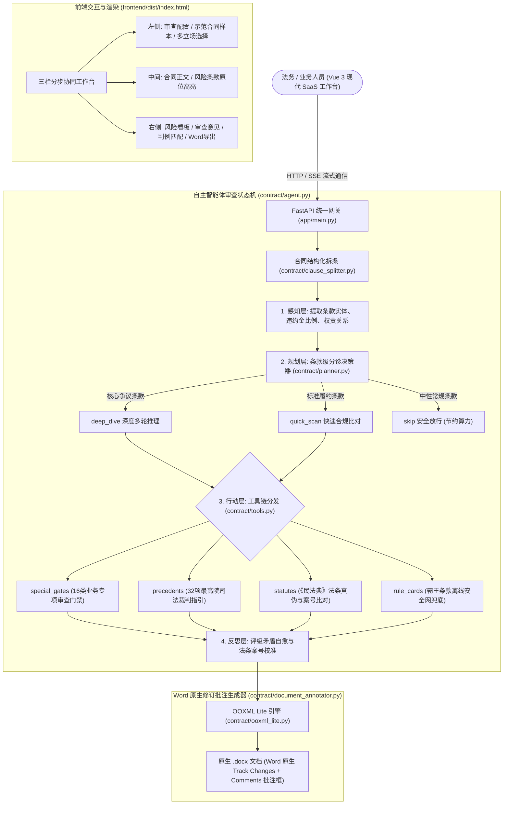

# 合同审查 AGENT · 企业级合同合规智能审查系统 (v2.0)

基于 **FastAPI + Vue 3 + Tailwind CSS + OOXML Lite + LM Studio / 端侧大模型** 的企业级合同合规智能审查、风险诊断与原生 Word 修订批注导出系统。同时提供 **WorkBuddy stdio MCP 工具**（`contract-reviewer`），在 WorkBuddy 对话中拖入合同即可直接审查。

专为解决企业合同审查中**商业秘密上云泄露风险、传统大模型审查缺乏法律事实与判例支撑、审查意见停留在纯文本无法直接回填到 Word 原文档、以及审查标准不统一**等核心业务痛点而设计。

> 新电脑部署见 `../部署指南.md`。本项目与 kb-tool 互相独立，可单独部署。

---

## 🤖 WorkBuddy MCP 工具（contract-reviewer）

`mcp_server.py` 提供共 **10 个工具**，分双轨运行：

| 轨道 | 工具 | 说明 |
|---|---|---|
| 轻量轨（纯规则引擎，零 LLM 依赖，秒级） | `scan_clause_risk` `lookup_statute` `search_precedent` `detect_contract_type` `get_clause_rewrite` | 实现 `contract/mcp_tools.py`，不依赖 LM Studio |
| 完整轨（LLM 深度审查，需 LM Studio） | `review_contract` `review_contract_file` `export_annotated_docx` `draft_new_contract` | 返回审查摘要 + 原文件同目录自动生成 Word 红线批注版 |
| 诊断 | `ping` | 环境体检验测（LM Studio 在线状态 / 可用模型 / 处理指引） |

**一键接入**：进入本项目文件夹双击 `一键安装到WorkBuddy.bat`（等效
`python install_to_workbuddy.py`），幂等完成 venv/依赖安装（含 **mcp 版本兼容性体检**：
MCP SDK 2.x 移除了 `mcp.server.fastmcp`，会让服务 import 即崩 —— 检测到不兼容会自动降级修复）、
mcp.json 注册、Skill 部署（`deploy/skills/contract-review`）、用户记忆路由规则写入，以及
**端到端体检**（真实启动 MCP → 握手计时 → 列工具 → 调 `ping` 环境检测）。
可选参数 `--mcp-only`、`--no-verify`。安装后唯一手动步骤：WorkBuddy 连接器页对
`contract-reviewer` 点一次「信任」。

> ⚠️ `一键安装到WorkBuddy.bat` 必须保持**纯 ASCII + CRLF**（注释/`title` 也不要写中文）：
> cmd.exe 读取含多字节字符的批处理会读偏移错位、把行片段当命令执行
> （实测症状：`'xx' is not recognized as an internal or external command`）。
> 中文提示由安装脚本输出（bat 内已 `chcp 65001`）。

### 审查用的模型：本地 LM Studio 或云端 API（界面可选）

模型由**右上角「模型管理」面板**决定（2026-09-17 新增，见后文「模型管理」一节）。选定规则：

1. **单次请求显式指定**的模型（若有）→ 优先；
2. 环境变量 `AGENT_MODEL`（**管理员级硬锁定**，默认留空）→ 用它；
3. **模型管理面板的配置**：
   - 面板选「本地模型」→ 用它指定的本地模型；本地模型留空时才走下面的自动优选；
   - 面板选「云端模型」→ 整体走云端 API（**此时合同文本会发往所选服务商，数据出本机**）；
4. 本地且未指定模型时的自动优选：**优先复用你当前会话正在使用的本地模型**
   （若会话选的是 `custom-local:xxx` 且此刻**已加载**，直接用它可以避免 LM Studio 换模型的
   分钟级卸载/重载开销）→ 否则按原逻辑优选已加载模型（优先 instruct 类 qwen）→ 最后兜底 `DEFAULT_MODEL`。

> 隐私提示：**只有本地模型模式才是"合同不出本机"**；轻量轨的规则扫描/法条/判例检索始终在本地执行。

> 会话用的是**云端模型**（deepseek-v4.1-flash / hy3 / kimi-* 等）时，工具进程拿不到
> WorkBuddy 的云端凭据，**不做任何干预**，按第 3 条走本机模型。这是刻意的设计：
> 审查链路保持纯本地、零额外时延。
>
> 用 `ping` 工具可查看当前会选用哪个模型。

---

## 🛠️ 系统全景架构



---

## 🔥 核心特性与技术亮点

1. **四阶段自主 Agent 闭环状态机 (Perceive-Plan-Act-Reflect Loop)**：
   - **感知 (Perception)**：由 `clause_splitter.py` 将合同结构化拆条，提取违约金、管辖权、知识产权归属等关键要素；
   - **规划 (Planning)**：由 `planner.py` 实施条款级自主分诊（`deep_dive` 深度审查、`quick_scan` 快速扫描、`skip` 安全放行），兼顾深度与高吞吐；
   - **行动 (Action)**：由 `tools.py` 动态调度 16 类专项门禁、32 项最高院判例库、民法典法条校验器与离线规则卡片；
   - **反思 (Reflection)**：自动检视审查结论与证据链的一致性，智能自愈评级矛盾，坚决杜绝大模型法条幻觉与事实脱节。

2. **企业级现代 SaaS 交互设计 (Modern SaaS Workbench)**：
   - 采用国际流行 SaaS 设计语言（Slate 调色板、圆角卡片、高对比度微渐变、清晰层次排版）。
   - 风险分级雷达标记：高危（红色）、中危（橙色）、低危（黄色）、放行（绿色），风险要点与原位条款智能关联。
   - 深度纯净清洗机制：彻底剔除前端多余的 Markdown、反引号、代码块残留，阅读体验丝滑清爽。

3. **100% 物理隔离与本地隐私计算 (Zero Data Leakage)**：
   - 专为企业核心商业合同、投资协议、保密协议打造。
   - 默认对接 `LM Studio` / 本地端侧推理服务（默认接入 `http://127.0.0.1:1234/v1`），审查全过程数据不离开本地物理设备。

4. **16 大类专项审查门禁与深水区条款深挖**：
   - 覆盖**股权转让与投资合伙、业绩对赌与补偿、反稀释保护、商业租赁、软件开发交付、买卖购销、劳动用工与保密竞业**等核心场景。
   - 自动识别隐蔽性极强的深水区免责套路、无限连带责任、违约金倒挂等不平等条款。

5. **32 项最高人民法院/裁判文书网法条判例知识库**：
   - 融合《中华人民共和国民法典》、《最高人民法院关于适用〈民法典〉合同编通则若干问题的解释》以及代表性司法裁判指引。
   - 审查意见自动附带**司法案号**与**裁判规则**（例如违约金过高司法酌减 30% 裁判规则、业绩对赌回购认定标准等），权威可信。

6. **真正的 Word 原生修订与批注导出 (OOXML Native Track Changes & Comments)**：
   - 业界突破性轻量级方案，无需配置复杂的外部渲染服务或依赖 Office 进程。
   - 基于纯 Python 实现的 OOXML 语法树操作，将审查修改建议直接转换为 Word 原生**删除线 (`<w:del>`)、插入线 (`<w:ins>`) 与边栏气泡批注 (`<w:comment>`)**。
   - 导出的 Word 文档在 Microsoft Word、WPS 中打开时，法务可直接点击“接受所有修订”或“逐项审阅批注”，无缝嵌入企业流转协同。

7. **权威示范文本库与智能快速起草 (Model Contract Fast Synthesis)**：
   - 内置覆盖**商品买卖采购、软件技术开发、商业房屋租赁、劳动人事聘用、商业保密协议(NDA)、企业借款担保、商务咨询居间**等 7 大主流商事合同的标准示范范本库（严格遵循《中华人民共和国民法典》及行业合规规范）。
   - **毫秒级插槽极速装配**：自动提取甲乙方主体、合作标的、付款账期与特约防守要求，**0.03 毫秒极速合成 2400+ 字标准正式合同初稿**，彻底终结大模型从零盲写的分钟级延迟、截断与幻觉风险。
   - **三国立场自适应调优**：支持**【偏向甲方 (采购/委托方)】**、**【偏向乙方 (供应/受托方)】**、**【中立对等 (双向平衡)】**三种立场，自动调优违约责任赔偿上限、付款/交付抗辩权与争议管辖约定。
   - **双阶弹性兜底**：若遇到未收录的非标类型，自动平滑回退至本地端侧大模型从零起草，并配备 `<think>` 深度思考思维链清洗机制，确保交付文档规范整洁。

---

## 📂 项目目录结构

```
合同审查/
├── mcp_server.py                  # [MCP] stdio MCP 服务入口（10 工具，握手先行、重库懒加载）
├── install_to_workbuddy.py        # [MCP] WorkBuddy 一键安装脚本（venv/注册/Skill/记忆/体检）
├── 一键安装到WorkBuddy.bat        # [MCP] 双击一键接入 WorkBuddy
├── deploy/skills/contract-review/SKILL.md   # [MCP] 随项目分发的对话路由路标
│
├── run.py                         # [Web] 系统一键启动入口 (FastAPI + Uvicorn + 自动打开浏览器)
├── 一键启动.bat                   # [Web] Windows 环境双击一键极速启动脚本
├── config.py                      # 统一运行时配置文件 (端口 8020 / LM Studio 接入配置)
├── README.md                      # 系统架构与使用指南
├── requirements.txt               # Python 依赖清单
├── .env.example                   # 环境变量配置参考范本
├── .gitignore                     # Git 忽略规则
├── sample_contract.py             # 内置真实商业合同样本集 (股权/租赁/软件/劳动)
│
├── app/                           # FastAPI 服务层
│   ├── main.py                    # API 路由装配、CORS 配置与前端静态资源挂载
│   ├── schemas.py                 # Pydantic 请求与响应数据结构契约
│   └── routes/
│       ├── contract.py            # 审查、流式推理、判例检索、示范起草与 Word 批注导出路由
│       └── model_admin.py         # [模型管理] 本地/云端模型配置读写、本地模型列表与连通性测试路由
│
├── model_config.json              # 模型管理配置（含云端 API Key，已 gitignore；缺失则以本地 gemma 为默认）
│
├── contract/                      # 智能体核心算法与风控逻辑层
│   ├── draft_templates.py         # [范本引擎] 权威商事合同示范文本库与插槽快速合成引擎（7大类示范合同，毫秒级出稿）
│   ├── mcp_tools.py               # [MCP] 轻量轨 5 工具（纯规则引擎，零 LLM 依赖）
│   ├── model_config.py            # [模型管理] 配置持久化、生效值解析、密钥掩码与云端预设（DeepSeek/Kimi/通义/智谱/自定义）
│   ├── session_model.py           # [模型优选] 读取 WorkBuddy 会话正在用的本地模型（custom-local:* 前缀）
│   ├── agent.py                   # [Agent 核心] 感知→规划→行动→反思四阶段自主闭环状态机
│   ├── planner.py                 # [规划层] 条款级分诊决策器（deep_dive / quick_scan / skip）
│   ├── clause_splitter.py         # [感知层] 合同结构化拆条与特征提取引擎
│   ├── rule_cards.py              # [规则安全网] 离线高危霸王条款穿透与交叉验证兜底
│   ├── statutes.py                # [法条核验] 法律引用真伪与案号一致性核查
│   ├── tools.py                   # [行动层] Agent 工具箱与动态调用分发
│   ├── engine.py                  # 审查与起草流程调度中枢、模型优选与多轮推理管线
│   ├── parser.py                  # 混合文本与段落结构化解析器
│   ├── prompts.py                 # 针对法务立场的防御性系统提示词工程
│   ├── precedents.py              # 32 项最高院裁判指引与司法案例库
│   ├── ooxml_lite.py              # 轻量级 OOXML 批注与修订语法底层引擎
│   ├── document_annotator.py      # Word 批注封装与字节流导出器
│   ├── data/                      # 预置标准条款与风控标签字典
│   │   ├── clause_standards.csv
│   │   ├── contract_types.csv
│   │   ├── review_checklists.csv
│   │   └── risk_labels.csv
│   └── gates/                     # 16 类专项审查门禁与条款级深水区门禁
│       └── special_gates.py
│
├── frontend/                      # 现代 SaaS 交互工作台前端
│   └── dist/
│       ├── index.html             # 单页现代 SaaS 工作台 (Vue 3 + Tailwind + Element Plus，支持 Agent 轨迹与示范起草)
│       └── marked.min.js          # 本地 Markdown 解析脚本
│
└── tests/                         # 自动化测试与质量检验套件
    ├── verify_all.py              # 核心模块自动化集成测试脚本
    ├── test_draft_create.py       # 示范范本快速起草与接口端到端测试（7类范本、立场自适应、<50ms时延）
    ├── test_agent_plan.py         # Agent 规划层单测（评分矛盾裁决、预算裁剪、兜底）
    ├── test_agent_loop_guard.py   # Agent 预算守卫与自愈循环单测
    ├── test_agent_reflect.py      # Agent 反思层单测（法条核查、交叉比对）
    ├── test_reasoning.py          # 完整轨审查推理链路测试
    ├── test_stream_debug.py       # 流式输出调试测试
    ├── test_contract_review.py    # 审查逻辑单元测试
    ├── test_annotator.py          # Word 批注导出功能验证
    ├── test_api.py / test_api_endpoints.py   # FastAPI 接口自动化用例
    ├── test_lmstudio_conn.py      # LM Studio 本地服务连通性测试
    └── test_universal_audit.py    # 通用风控规则测试
```

---

## 🚀 快速启动与自举说明

### 1. 前置条件与环境准备
- **Python 环境**：建议 **Python 3.11 – 3.13**（安装时请务必勾选 `Add Python to PATH` 以及 `Install launcher for all users (py)`）。
- **推理服务**：
  - **本地模式（推荐）**：后台启动 **LM Studio**，加载大模型（如 `qwen3.8-27b` 或 `qwen2.5-14b`），并在 1234 端口开启 Local Server。
  - **云端模式**：工作台支持在线切换至 DeepSeek 等云端大模型 API。

### 2. 一键自举启动 (推荐)
- 直接在文件管理器中双击运行 **`一键启动.bat`**。
- **自举特性**：
  - 脚本将优先调用 `py -3`（防御微软商店假占位符）；
  - 自动检测并创建本项目专属的独立的 `.venv` 虚拟环境；
  - 自动安装并补全所有依赖组件（包含 `FastAPI`, `PyMuPDF`, `python-multipart`, `python-docx` 等）；
  - 随后自动拉起服务并在浏览器中打开工作台：`http://localhost:8020`。
  - 具备严格幂等性，日常反复双击秒级启动。

### 3. 命令行启动
```bash
cd 合同审查
# 激活虚拟环境后运行
.venv\Scripts\python run.py
```

---

## 🧪 自动化测试与验证

项目提供了一体化自动化验证套件，覆盖门禁路由、判例检索、Word 原生批注导出、接口可用性等全流程：

```bash
python tests/verify_all.py
```

执行后将运行以下 5 大测试项并报告结果：
1. `[1]` 验证 16 类专项门禁与条款级深水区门禁路由
2. `[2]` 验证判例库与检索召回 (32 项司法判例)
3. `[3]` 验证 Word 原生 Track Changes 批注导出 (带风险条款标注)
4. `[4]` 验证 Word 原生批注导出 (无风险绿标放行)
5. `[5]` 验证 FastAPI 核心接口与静态前端挂载

## ⚡ 性能与调优（2026-09-17 最新演进：彻底去除门槛）

系统已于 2026-09-17 彻底消除合同字数与条款数门槛限制。**不论用户上传任何长度、格式或排版的真实合同，均 100% 进入 Agent 闭环，并实时透传四阶段决策轨迹与模型深度思考思维链**。

| 场景 | 链路 | 决策轨迹 | 思维链 (Thinking) | 说明 |
|---|---|---|---|---|
| 任意用户上传/示范合同（含短合同、长合同、非标段落排版） | **Agent 全链路**（感知→规划→逐条款深查/快筛→反思） | ✅ 全量展示四阶段面板 | ✅ 规划+逐条深查连续流 | 自适应条款拆分（正则/LLM兜底/双换行保底） |
| 异常/单次保命降级 | **单次深度审计** | ✅ 降级通知与状态流 | ✅ 流式解封输出思考流 | 彻底移除 `</think>` 截断，保留真实推理 |

### 可调项（都在 `config.py`，均支持环境变量覆盖）

| 变量 | 默认 | 作用 | 调整建议 |
|---|---|---|---|
| `AGENT_ENABLED` | `True` | 是否启用 Agent 全链路闭环 | 默认开启，全局主导 |
| `AGENT_SMALL_CONTRACT_CHARS` | **0** | 小合同豁免字数阈值 | 已置 0，彻底去除字数门槛 |
| `AGENT_SMALL_CONTRACT_CLAUSES` | **0** | 小合同豁免条款数阈值 | 已置 0，彻底去除条款数门槛 |
| `AGENT_MAX_DEEP_DIVE` | **3** | Agent 深查条款数上限 | 每 +1 条 ≈ +50 秒，默认 3 兼顾深度与端侧时延 |
| `AGENT_TIME_BUDGET_SECONDS` | 1500 | Agent 全局时间预算 | 一般不动 |

> ℹ️ **改完开新会话即可生效**：
> 原理：MCP 服务随会话拉起（per-session sidecar），新会话 = 新进程 = 读到新配置；
> Web 服务重启 `run.py` 即可立即加载新配置。

### 本地模型侧（LM Studio）

- **上下文给到 65536 即可**（WorkBuddy 首轮提示约 36.7K；给 131072 会多占约 3GB 内存）。
  实测：`131072` → 可用内存 5.0GB；`65536` → **7.9GB**。
  ```bat
  "C://Users//ASUS//.lmstudio//bin//lms.exe" unload --all
  "C://Users//ASUS//.lmstudio//bin//lms.exe" load "google/gemma-4-e4b" -c 65536 --parallel 1 -y
  ```
- **不要同时加载两个大模型**（曾因内存紧张触发 `400 Model unloaded`，导致部分条款模型调用失败）。
- **演示前先"预热"**：先在会话里发一句任意短问（如"你好"），让 37K 系统提示的 KV 缓存建好，**再拖合同** —— 可省掉首轮冷启动的 ≈100~180 秒（实测冷预填充 42K tokens 需 104 秒，缓存命中后仅 0.8 秒）。

### 模型选择建议（2026-09-15 实测对比）

> **当前主力：`google/gemma-4-e4b`**（本机已加载，上下文 64K）。
> 下表 A/B 实测的关键结论是：**同一模型在不同 SKILL.md 写法下表现差异巨大** —— gemma 在「冗长硬规则版」下 0/3，
> 换成「极简版」后 **3/3 全部正确且最快（9~12s）**。因此它完全可用，前提是技能文件保持精简。

| 模型 | 大小 | 64K 显存预估 | 工具调用形状正确率（A/B，3 次/组） | 单次响应 | 结论 |
|---|---|---|---|---|---|
| **`google/gemma-4-e4b`（当前）** | 7.5B(激活4B) | 9.63 GiB | 冗长版 **0/3** → **极简版 3/3** ✔ | 9~12s（极简版） | ✅ **当前使用** |
| `qwen/qwen3.5-9b` | 9B | 10.04 GiB | **3/3** ✔ | **9.7~13.3s** | ✅ 备选，工具调用更稳 |
| `qwen3.6-27b` | 27B | 25.66 GiB | —（未测） | — | ⚠️ 本机内存不足（总 31.3GB），易触发模型卸载 |
| `qwen3.6-35b-a3b` | 35B-A3B | 23.30 GiB | —（未测） | — | ⚠️ 同上 |
| `qwen2.5-14b-instruct` | 14B | — | — | — | ❌ 上下文上限仅 32,768，装不下 36.7K 系统提示 |

**当前配置（保持 gemma 不变）**：
```bat
"C://Users//ASUS//.lmstudio//bin//lms.exe" unload --all
"C://Users//ASUS//.lmstudio//bin//lms.exe" load "google/gemma-4-e4b" -c 65536 --parallel 1 -y
```
- **保持"同一时刻只加载一个模型"**：两个大模型并存会因内存紧张被自动卸载，导致工具调用中途失败。
- 若日后追求更高的工具调用稳定性，可换 `qwen/qwen3.5-9b`（对话模型也要一起切）。

### 模型管理（2026-09-17 新增：界面切换本地 / 云端）

界面上方右侧的模型胶囊即入口（显示"本地/云端 + 当前审查模型"，点击打开「模型管理」弹窗）：

| 能力 | 说明 |
|---|---|
| 本地模型（LM Studio） | 填服务地址（默认 `http://127.0.0.1:1234/v1`）+ 下拉选模型（区分"已加载/全部"，可一键刷新）；**选空 = 自动优选**（跟随会话模型 / 已加载模型） |
| 云端模型（API） | 内置 DeepSeek / Kimi / 通义千问 / 智谱 GLM / 自定义，填服务商、模型、接口地址与 API Key |
| 测试连接 | 先探测 `GET /models`，失败退回 1-token 最小对话调用；返回耗时与具体错误原因 |
| 保存并生效 | 写入 `model_config.json` 后**立即生效**（每次审查都会重新读取配置），无需重启服务 |

- 选择本地模型后，**审查模型随即切换为面板中配置的那个本地模型**；切到云端则所有审查/初稿/起草入口整体走云端 API。
- 选定优先级：**单次请求显式指定 > 环境变量 `AGENT_MODEL`（管理员硬锁定，默认留空）> 模型管理面板配置 > 本地自动优选 > `DEFAULT_MODEL` 兜底**。
- **本地/云端的归类按"实际地址"判定，而不是按声明的开关**（2026-09-17 修订）：
  - `base_url` 指向**本机回环**（`127.0.0.1` / `localhost` / `::1`）→ 判为**本地**（数据不出本机）；
  - 指向其它地址（如 `https://api.deepseek.com/v1`）→ 判为**云端/远程**。
  - 因此若你沿用旧做法、用环境变量 `LM_STUDIO_BASE_URL` 接云端（该变量名历史遗留），系统会**自动按云端归类**，不再误标成"本地"；
    界面会给出「模型归类提示」，面板也会默认切到「云端模型」页签，建议顺手核对一下密钥。
  - 声明与真实不一致时，`/api/model/config` 会返回 `effective.provider_matches=false` 与 `effective.note` 供前端提示。
- 配置文件 `model_config.json`（项目根目录）**已加入 `.gitignore`**：API Key 只存本机，接口仅回显掩码，不会进公开仓库。
- 相关接口：`GET /api/model/config`（当前配置，密钥脱敏）、`GET /api/model/local/list`（本机模型，区分已加载）、`POST /api/model/config`（保存即生效）、`POST /api/model/test`（连通性测试）。
- ⚠️ **选云端 = 合同文本会发往云端服务商**；涉密/敏感合同请使用本地模型（轻量轨的规则扫描/法条/判例始终在本地执行）。
- ⚠️ 本项目代码**不加载 `.env`**（`config.py` 直接读 `os.getenv`），`.env` 里的模型变量不生效——换模型请用界面，或把变量真正设进进程环境（`mcp.json` 的 `env` 块 / 启动脚本 `set` / 系统环境变量）。
- 改完需**重启 8020 Web 服务**（加载新路由）；MCP 服务 `contract-reviewer` 也需重连才用上新引擎。

### 配套：技能文件必须保持"极简"

A/B 实验最重要的结论 —— **对 4B 级小模型，指令要"短、聚焦、可执行"**：

| 技能版本 | 体积 | 拖合同直接调用成功率 |
|---|---|---|
| 冗长硬规则版（多个 ⛔ 大段） | ~7.3 KB | **0/3，且全部空转**（无调用、无文本） |
| **极简版（一条规则 + 一个模板 + 两个反例）** | ~1.0 KB | **3/3 全部正确**，且最快 |

修改 `contract-review` / `enterprise-kb-query` 的 SKILL.md 时，**不要再加"禁止/最高优先级"大段文字**；
只保留：可照抄的正确 JSON 形状 + `toolName`/`params` 平级口诀 + 一句默认动作 + 失败如实说明。
