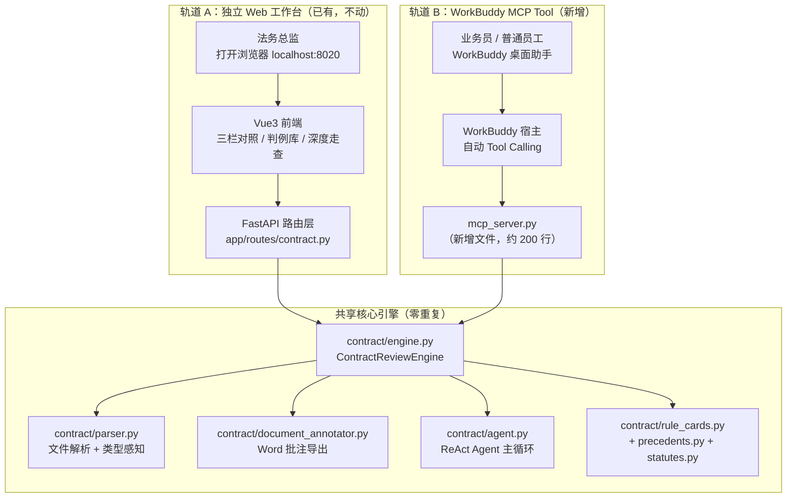

# 合同审查双轨方案：保留独立 Agent 工作台 + 新增 MCP Tool 接入 WorkBuddy

## 背景与目标

合同审查项目当前是一个完整的独立 Web Agent（FastAPI 8020 端口 + Vue3 前端），具备 ReAct Agent 主循环、16 道门禁、20 判例库、OOXML 红线批注与 Word 导出。

**双轨目标**：
- **轨道 A（保留）**：独立 Web 工作台不动，继续作为法务总监的重大合同深度审查驾驶舱
- **轨道 B（新增）**：新增一个 MCP Server 脚本，将核心能力暴露为 WorkBuddy 可调用的 Tool，实现日常合同"拖进去就改好"的轻量体验

## User Review Required

> [!IMPORTANT]
> **MCP Server 与现有 FastAPI 是两个独立进程**。MCP Server 启动后由 WorkBuddy 托管（配置后自动拉起），不影响现有 `一键启动.bat` 和 8020 端口 Web 工作台。两者共享同一份底层 Python 引擎代码，零重复。

> [!IMPORTANT]
> **LM Studio 依赖**：MCP 轨道同样需要本地 LM Studio 运行。如果 LM Studio 未启动，WorkBuddy 调用 Tool 时会收到明确的错误提示而非静默失败。

## Open Questions

1. **WorkBuddy 目前是否已部署在您的电脑上？** MCP Server 注册需要在 WorkBuddy 的配置文件中添加一条记录。如果尚未安装，方案仍然可以先写好 MCP Server 代码备用。
2. **是否需要支持云端模型？** 当前独立 Agent 仅用本地 LM Studio。MCP 轨道是否也只走本地，还是允许在 WorkBuddy 中选择云端 API（如 DeepSeek）？
3. **Word 批注版文件的保存位置**：WorkBuddy 拖入合同后生成的批注版 `.docx`，是默认保存到桌面、原文件同目录、还是固定输出目录（如 `D:\合同审查输出`）？

---

## 现有代码架构分析

```
合同审查/
├── config.py                  ← 全局配置（LM Studio URL、模型名、Agent 预算）
├── run.py                     ← uvicorn 启动入口
├── app/
│   ├── main.py                ← FastAPI 应用（挂路由 + 前端静态文件）
│   ├── schemas.py             ← Pydantic 请求/响应模型
│   └── routes/contract.py     ← HTTP API 路由（upload/review/export-docx/draft）
├── contract/                  ← ★ 核心引擎层（与 HTTP 完全解耦）
│   ├── engine.py              ← ContractReviewEngine（审查主循环、初稿生成、Word 导出）
│   ├── agent.py               ← ContractReviewAgent（ReAct 状态机）+ LLMClient
│   ├── parser.py              ← 多格式文件解析 + 合同类型自动感知
│   ├── clause_splitter.py     ← 条款拆分器
│   ├── planner.py             ← Agent 规划器
│   ├── prompts.py             ← 系统提示词库
│   ├── tools.py               ← Agent 行动层工具注册表
│   ├── precedents.py          ← 20 判例库检索
│   ├── statutes.py            ← 法条检索
│   ├── rule_cards.py          ← 规则引擎卡片
│   ├── document_annotator.py  ← Word 批注与修订导出
│   ├── ooxml_lite.py          ← OOXML Track Changes 引擎
│   └── gates/                 ← 专项门禁
└── frontend/dist/             ← Vue3 编译产物（静态文件）
```

> [!TIP]
> **关键发现**：`contract/` 目录下的所有核心逻辑**与 FastAPI 路由层完全解耦**。`engine.py` 暴露的 `ContractReviewEngine` 类可以被任何调用方直接实例化使用，不依赖 HTTP 请求上下文。这意味着我们只需要写一个极薄的 MCP 适配层即可。

---

## 双轨架构总览



---

## Proposed Changes

### 核心引擎层（contract/）

#### [MODIFY] [engine.py](file:///C:/Users/ABC/Desktop/123/合同审查/contract/engine.py)

新增一个**同步阻塞式的非流式审查方法** `review_full()`，供 MCP Tool 调用。

原因：现有的 `stream_review()` 是 `async generator`（SSE 流式），适合前端实时展示。但 MCP Tool 需要的是"调一次，返回完整结果"的同步接口。

```python
async def review_full(
    self,
    contract_text: str,
    contract_type: str = None,
    client_role: str = "中立合规把关",
    review_stance: str = "对等平衡",
) -> dict:
    """
    非流式完整审查（供 MCP Tool 调用）。
    内部复用 stream_review()，收集全部帧后返回结构化结果。
    返回: {
        "report": str,          # 完整审查报告 Markdown
        "draft": str,           # 合规修改初稿
        "is_perfect": bool,     # 是否合规良好无需修改
        "contract_type": str,   # 识别出的合同类型
        "char_count": int,      # 合同字数
    }
    """
    report_parts = []
    draft_text = ""
    is_perfect = False
    detected_type = contract_type or ""
    char_count = 0

    async for frame in self.stream_review(
        contract_text=contract_text,
        contract_type=contract_type,
        client_role=client_role,
        review_stance=review_stance,
    ):
        if frame.get("type") == "status":
            detected_type = frame.get("detected_type", detected_type)
            char_count = frame.get("char_count", char_count)
        elif frame.get("type") == "content":
            report_parts.append(frame.get("delta", ""))
        elif frame.get("type") == "draft":
            draft_text = frame.get("data", "")
            is_perfect = frame.get("is_perfect", False)

    return {
        "report": "".join(report_parts).strip(),
        "draft": draft_text,
        "is_perfect": is_perfect,
        "contract_type": detected_type,
        "char_count": char_count,
    }
```

> 这个方法**不改动任何现有逻辑**，纯粹是对 `stream_review()` 的消费包装。

---

### MCP Server 适配层（新增）

#### [NEW] [mcp_server.py](file:///C:/Users/ABC/Desktop/123/合同审查/mcp_server.py)

这是整个方案的核心新增文件。使用 Python 官方 `mcp` 库的 `FastMCP` 注册 4 个 Tool：

| Tool 名称 | 功能 | WorkBuddy 中的触发方式 |
| :--- | :--- | :--- |
| `review_contract` | 审查合同文本（纯文字输入） | 用户粘贴合同文字并说"帮我审查" |
| `review_contract_file` | 审查合同文件（docx/pdf/txt） | 用户拖入 `.docx` 文件并说"帮我审" |
| `export_annotated_docx` | 导出带红线批注的 Word 文件 | 审查完成后用户说"导出 Word 批注版" |
| `draft_new_contract` | 从零起草新合同 | 用户说"帮我起草一份采购合同" |

```python
# 伪代码结构（实现时约 200 行）
from mcp.server.fastmcp import FastMCP
import sys, os, asyncio

# 确保 contract/ 包可导入
sys.path.insert(0, os.path.dirname(__file__))

mcp = FastMCP(
    "contract-reviewer",
    instructions="企业合同合规审查工具集。可审查合同文本或文件、导出带批注的Word、从零起草新合同。"
)

@mcp.tool()
async def review_contract(
    contract_text: str,
    stance: str = "中立合规把关",
    review_style: str = "对等平衡",
) -> str:
    """
    审查合同文本，识别法律风险并给出修改建议。
    - contract_text: 合同全文文本
    - stance: 审查立场（甲方/乙方/中立合规把关）
    - review_style: 审查风格（对等平衡/强势防守/商业促成）
    返回：完整的法律风险审查报告（Markdown 格式）
    """
    from contract.engine import engine
    result = await engine.review_full(contract_text, client_role=stance, review_stance=review_style)
    # 拼装返回
    ...

@mcp.tool()
async def review_contract_file(file_path: str, stance: str = "中立合规把关") -> str:
    """
    审查合同文件（支持 .docx / .pdf / .txt），自动解析并执行全维度法律审查。
    - file_path: 合同文件的完整路径
    - stance: 审查立场
    返回：审查报告 + 批注版 Word 文件路径
    """
    from contract.parser import parse_uploaded_file
    from contract.engine import engine
    # 1. 读取文件字节
    # 2. 调 parse_uploaded_file 解析
    # 3. 调 engine.review_full 审查
    # 4. 调 engine.export_annotated_docx 生成批注版 Word
    # 5. 返回报告摘要 + 批注版文件路径
    ...

@mcp.tool()
async def export_annotated_docx(
    original_text: str,
    review_report: str,
    title: str = "合同审查审阅批注版",
    output_dir: str = "",
) -> str:
    """
    将审查结果导出为带 Word 原生批注（Comments）与修改痕迹（Track Changes）的 .docx 文件。
    返回：生成的 .docx 文件完整路径
    """
    from contract.engine import engine
    # 生成到 output_dir 或桌面
    ...

@mcp.tool()
async def draft_new_contract(
    contract_type: str,
    party_a: str,
    party_b: str,
    core_subject: str,
    payment_terms: str = "按阶段验收付款",
    special_terms: str = "",
    stance: str = "甲方",
) -> str:
    """
    从零智能起草一份新合同初稿。
    返回：完整合同初稿文本
    """
    from contract.engine import engine
    return await engine.generate_new_draft(...)

if __name__ == "__main__":
    mcp.run()
```

---

### 依赖更新

#### [MODIFY] [requirements.txt](file:///C:/Users/ABC/Desktop/123/合同审查/requirements.txt)

新增 MCP SDK 依赖：

```
mcp[cli]>=1.0.0
httpx>=0.27.0
```

> `httpx` 是 `mcp` 的传递依赖，显式声明确保版本兼容。现有代码 `engine.py` 中已使用 `httpx`，无冲突。

---

### WorkBuddy 配置注册

#### [NEW] [workbuddy_mcp_config.json](file:///C:/Users/ABC/Desktop/123/合同审查/workbuddy_mcp_config.json)

提供一份配置示例文件，用户复制到 WorkBuddy 的全局配置中即可：

```json
{
  "mcpServers": {
    "contract-reviewer": {
      "command": "C:/Users/ABC/Desktop/123/合同审查/.venv/Scripts/python.exe",
      "args": ["C:/Users/ABC/Desktop/123/合同审查/mcp_server.py"],
      "env": {
        "LM_STUDIO_BASE_URL": "http://127.0.0.1:1234/v1"
      }
    }
  }
}
```

> [!NOTE]
> 使用项目自身的 `.venv` 虚拟环境 Python 解释器，确保所有依赖已安装，且与其他项目完全隔离。

---

### 文档更新

#### [MODIFY] [README.md](file:///C:/Users/ABC/Desktop/123/合同审查/README.md)

在现有文档末尾新增 **"双轨使用指南"** 章节：
- 轨道 A（独立 Web 工作台）：保留现有说明
- 轨道 B（WorkBuddy MCP Tool）：说明如何安装 `mcp` 依赖、注册到 WorkBuddy、以及日常使用方式

---

## 实施工作量评估

| 文件 | 改动类型 | 预估行数 | 难度 |
| :--- | :--- | :--- | :--- |
| `contract/engine.py` | 新增 `review_full()` 方法 | ~30 行 | ★☆☆ 极低（纯包装） |
| `mcp_server.py` | **新建** MCP Server | ~200 行 | ★★☆ 中等 |
| `requirements.txt` | 新增 2 行依赖 | 2 行 | ★☆☆ |
| `workbuddy_mcp_config.json` | **新建** 配置示例 | ~12 行 | ★☆☆ |
| `README.md` | 追加双轨章节 | ~40 行 | ★☆☆ |

**总计：约 280 行新增/修改代码，不修改任何现有业务逻辑。**

---

## Verification Plan

### Automated Tests

1. **engine 新方法单元测试**：
   ```bash
   cd C:\Users\ABC\Desktop\123\合同审查
   .venv\Scripts\python.exe -c "import asyncio; from contract.engine import engine; print(asyncio.run(engine.review_full('甲方：A公司\n乙方：B公司\n甲方委托乙方开发一套管理系统，开发费用50万元。')))"
   ```

2. **MCP Server 冷启动验证**：
   ```bash
   .venv\Scripts\python.exe -c "from mcp_server import mcp; print('MCP Server 定义成功，工具数:', len(mcp._tools))"
   ```

3. **MCP Inspector 交互测试**（如已安装 `mcp[cli]`）：
   ```bash
   .venv\Scripts\python.exe -m mcp dev mcp_server.py
   ```
   在 Inspector Web UI 中手动调用 `review_contract` 和 `review_contract_file`，确认返回完整审查报告。

### Manual Verification

- 将 `workbuddy_mcp_config.json` 中的配置复制到 WorkBuddy 设置中，重启 WorkBuddy
- 在 WorkBuddy 对话框中拖入一份测试合同 `.docx`，验证自动触发审查并在桌面生成批注版 Word
- 确认现有 `一键启动.bat` → `localhost:8020` 的 Web 工作台功能完全不受影响
