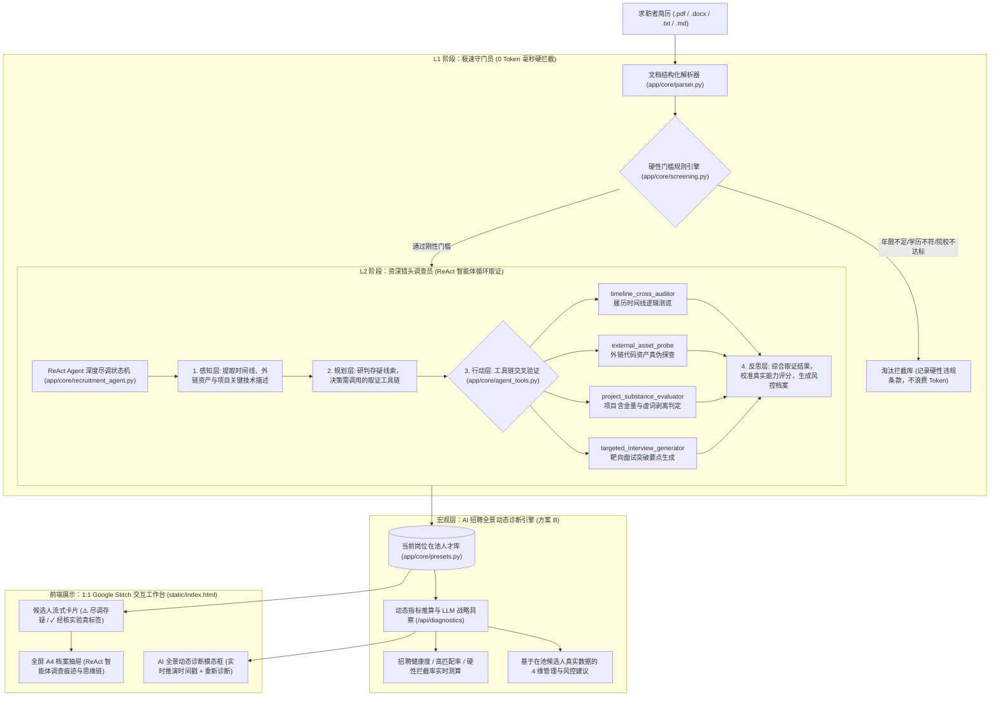

# RecruitAI · 企业智能招聘与简历深度尽调复合智能体 (v2.0)

基于 **FastAPI + Vue 3 + Tailwind CSS (Google Stitch 1:1) + LM Studio / 端云大模型** 的企业级智能招聘简历初筛与深度背调复合智能体系统。

针对传统招聘系统**“规则匹配死板、大模型单步打分容易被包装简历蒙蔽、缺乏跨时间线核验、无法识别练习Demo或划水经历、以及宏观诊断缺乏真实数据支撑”**等行业痛点，系统创新性地采用了**「漏斗式两段复合智能体（Two-Stage Funnel Compound Agent）」**架构与**「方案 B 真实数据驱动的宏观全景动态诊断引擎」**。

---

## 🛠️ 系统全景架构



---

## 🌟 核心特性与技术亮点

### 1. 漏斗式两段复合智能体 (Two-Stage Funnel Compound Agent)
* **L1 极速守门员（Workflow）**：对学历、院校层次（985/211）、工龄等刚性门槛实施毫秒级规则比对。不达标简历瞬间拦截并记录归档，**0 Token 消耗**，保障海量投递下的极高吞吐；
* **L2 资深猎头调查员（ReAct Agent）**：针对通过初筛的候选人，自动启动由大模型驱动的 ReAct 状态机循环（感知 → 规划 → 行动取证 → 反思定案），主动调用工具链多维度穿透履历包装。

### 2. 动作层 4 大资深猎头尽调工具链 (`app/core/agent_tools.py`)
1. **履历时间线逻辑测谎 (`timeline_cross_auditor`)**：
   * 自动交叉推算毕业年份、各段工作起止时段与职级抬头；
   * 智能识破倒挂破绽（如毕业仅 1-2 年却声称担任“首席架构师 / 研发总监”等）。
2. **外链代码资产真伪探查 (`external_asset_probe`)**：
   * 主动扫描简历中的 GitHub、博客或开源外链；
   * 识别仓库特征，敏锐预警教学练习 Demo、模板脚手架冒充大型生产项目的行为。
3. **项目含金量与划水判定 (`project_substance_evaluator`)**：
   * 深度分析项目业绩描述，剥离“负责推进、积极参与、协助沟通”等无实质贡献的模糊虚词包装；
   * 严格核验是否具备 QPS、性能提升百分比、架构演进等量化硬核指标。
4. **靶向面试突破要点生成 (`targeted_interview_generator`)**：
   * 针对 ReAct 循环中检出的疑点与矛盾点，直接为面试官定制 3 道具有攻防针对性的“测谎式”专业面试题。

### 3. 方案 B：AI 招聘全景动态诊断报告 (`/api/diagnostics`)
* **真实数学指标动态加权**：告别静态死板模态框，根据在池真实数据动态计算 `health_score`（招聘健康度）、`high_match_rate`（高匹配率）、`rejection_rate`（门槛拦截率）及样本量；
* **大模型宏观战略推演**：将真实在池名单（林远志、陈书婷、赵晨浩、张铭等真实背景、薪资预期及尽调疑点）注入大模型，输出高潜推进、过滤效率、薪资弹性与尽调风控 4 维管理决策建议；
* **动态刷新机制**：前端支持 **`🔄 重新诊断`**，展示实时推演时间戳，HR 随时基于最新人才库状态重新推算。

### 4. 严格 1:1 Google Stitch 视觉规范与全自适应工作台
* **设计还原**：严格复刻 Google Stitch 项目（`projects/4347107337271112305`）的 `Kinetic Emerald Workdesk` 配色规范（主色 `#00B395`、AI 紫 `#5039f6`）；
* **深度调查痕迹展示**：右侧 A4 简历抽屉中内嵌 **`🕵️ AI 资深招聘尽调与测谎痕迹（ReAct 智能体调查档案）`**，支持完整展开/收起 Agent 动态探查时间线；
* **自适应排版优化**：彻底解决分屏缩放下的排版 Bug，职位切换下拉框采用 `left-0` 视口防溢出锚定，顶栏主导航在平板与分屏（768px~1280px）下自适应完整呈现。

### 5. 双模多模型引擎（端云热切换）
* **本地离线端侧优先**：启动自检自动优先命中本地 LM Studio（`http://127.0.0.1:1234/v1`，模型推荐 `qwen3.8-27b`）；
* **商用云端平滑切换**：顶栏状态胶囊支持一键切换至 **DeepSeek (V3/R1)**、**通义千问 (DashScope)**、**月之暗面 (Kimi)** 等主流模型，自带连通性测速。

---

## 📂 项目完整目录结构

```
简历筛查/
├── run.py                         # 系统启动与自检脚本
├── config.json                    # 运行时配置文件 (端口 8030 / 端云模型设置，已脱敏)
├── 一键启动.bat                   # Windows 环境双击自举启动脚本
├── README.md                      # [v2.0] 复合智能体全景架构与使用指南
├── requirements.txt               # Python 依赖清单
│
├── app/                           # 后端核心业务层
│   ├── __init__.py
│   ├── config.py                  # 全局配置管理与服务商预设 (DeepSeek/DashScope/Moonshot)
│   ├── main.py                    # FastAPI 应用入口、生命周期探测与静态资源托管
│   ├── api/
│   │   ├── __init__.py
│   │   └── routes.py              # 候选人、职位、实时动态诊断 (/api/diagnostics) 与批处理路由
│   └── core/
│       ├── __init__.py
│       ├── agent_tools.py         # ★ 动作层独立工具箱 (时间线测谎/代码探查/水分剥离/靶向出题)
│       ├── recruitment_agent.py   # ★ ReAct Agent 深度尽调状态机与反思定案引擎
│       ├── screening.py           # 双轨漏斗串接器 (L1 极速拦截 + L2 智能体尽调调度)
│       ├── presets.py             # 预置真实候选人数据库 (含完整 deep_audit 尽调档案)
│       ├── parser.py              # 多格式简历解析器 (PyMuPDF / python-docx / 纯文本)
│       └── llm_client.py          # 端云多模型统一适配器 (LM Studio / Ollama / Cloud API)
│
├── static/                        # 前端单文件生产工作台
│   └── index.html                 # 1:1 Stitch 高保真工作台 (Vue 3 + Tailwind + ReAct 轨迹面板)
│
└── uploads/                       # 简历上传临时存储目录 (.gitignore 忽略)
```

---

## 🚀 快速启动与自举说明

### 1. 前置条件与环境准备
* **Python 环境**：建议 **Python 3.11 – 3.13**（安装时务必勾选 `Add Python to PATH` 以及 `py launcher`）；
* **大模型推理引擎**：
  * **本地模式（推荐）**：启动 **LM Studio**，加载 `qwen3.8-27b`（或 `qwen2.5-14b`），开启 Local Server（默认端口 `1234`）；
  * **云端模式**：可在工作台右上角模型胶囊中配置 DeepSeek 等云端 API Key。

### 2. 双击一键自举启动 (推荐)
直接双击运行项目目录下的 **`一键启动.bat`**：
* 脚本优先调用 `py -3` 解释器；
* 自动创建并激活独立的 `.venv` 虚拟环境，并安装全部必要依赖；
* 自动拉起 FastAPI 服务并调用默认浏览器打开：**`http://127.0.0.1:8030`**；
* 具备严格幂等性，日常反复双击秒级启动。

### 3. 命令行启动
```bash
cd 简历筛查
.venv\Scripts\python run.py
```

---

## 🖥️ 核心演示剧本推荐

1. **宏观态势与方案 B 全景动态诊断**：
   * 观察顶部数据看板（今日新投递、待人工初筛、AI高匹配推荐、已约面）；
   * 点击顶栏 **「AI 智能诊断」**，查看基于当前人才库真实算出的健康度、高匹配率、拦截率以及大模型实时生成的策略建议；点击左下角 **「🔄 重新诊断」** 查看动态重算动效。
2. **两段漏斗之 L1 极速守门员硬拦截**：
   * 切换至 **「淘汰/拦截库」** Tab，查看候选人“张铭”卡片；
   * 明确展示 L1 规则秒级拦截证据：`年限1年(要求5年+)`、`大专学历(要求统招本科)`，未浪费 1 个大模型 Token。
3. **两段漏斗之 L2 资深猎头 ReAct 深度尽调与测谎**：
   * 在主列表中查看“陈书婷”卡片，右上角即时警示 **`⚠️ 尽调存疑 (1项)`**；
   * 点击 **「查看简历」** 展开右侧 A4 抽屉，进入 **「AI 评估与追问」** 面板；
   * 展开 **`🕵️ AI 资深招聘尽调与测谎痕迹（ReAct 智能体调查档案）`**，观察 Agent 的完整思考与取证轨迹：
     * `[感知]` 提取技术栈与 Shopee 履历；
     * `[行动]` 调用 `project_substance_evaluator` 检出微前端与复杂中间层经验较薄弱；
     * `[反思]` 结合 985 学历与现代工程落地能力，综合评定 A 级 (91分) 并出具针对性靶向面试题。
4. **现场上传任意真实简历实测**：
   * 点击顶部 **「上传简历」**，拖入任意本地真实简历（`.pdf`, `.docx` 等），体验系统实时解析并驱动 L1/L2 双段漏斗初筛的全流程。
