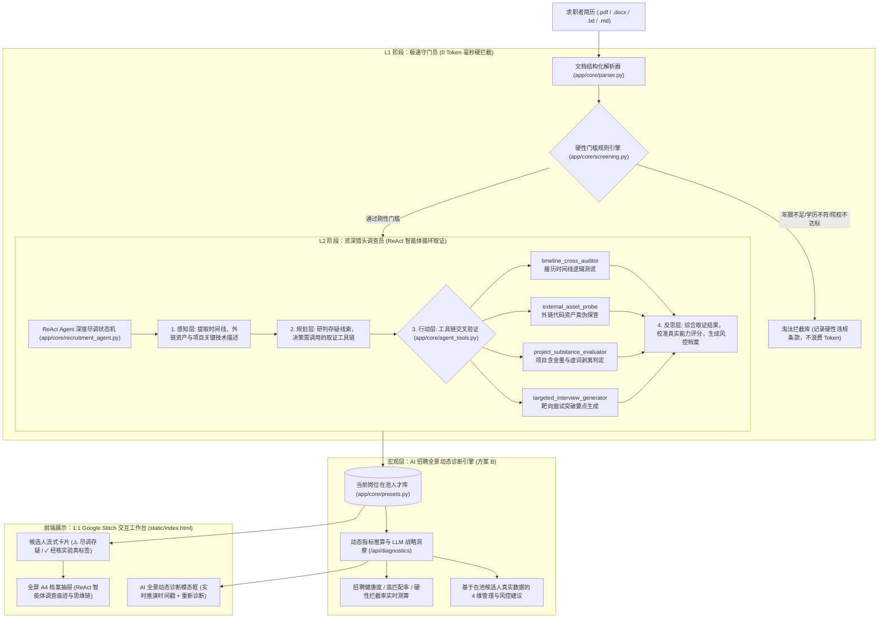

# RecruitAI · 企业智能招聘与简历深度尽调复合智能体 (v2.0)

基于 **FastAPI + Vue 3 + Tailwind CSS (Google Stitch 1:1) + LM Studio / 端云大模型** 的企业级智能招聘简历初筛与深度背调复合智能体系统。

针对传统招聘系统**“规则匹配死板、大模型单步打分容易被包装简历蒙蔽、缺乏跨时间线核验、无法识别练习Demo或划水经历、以及宏观诊断缺乏真实数据支撑”**等行业痛点，系统创新性地采用了**「漏斗式两段复合智能体（Two-Stage Funnel Compound Agent）」**架构与**「方案 B 真实数据驱动的宏观全景动态诊断引擎」**。

---

## 🛠️ 系统全景架构



---

## 🌟 核心特性与技术亮点

### 1. 漏斗式两段复合智能体 (Two-Stage Funnel Compound Agent)
* **L1 极速守门员（Workflow）**：对学历、院校层次（985/211）、工龄等刚性门槛实施毫秒级规则比对。不达标简历瞬间拦截并记录归档，**0 Token 消耗**，保障海量投递下的极高吞吐；
* **L2 资深猎头调查员（ReAct Agent）**：针对通过初筛的候选人，自动启动由大模型驱动的 ReAct 状态机循环（感知 → 规划 → 行动取证 → 反思定案），主动调用工具链多维度穿透履历包装。

### 2. 动作层 4 大资深猎头尽调工具链 (`app/core/agent_tools.py`)
1. **履历时间线逻辑测谎 (`timeline_cross_auditor`)**：
   * 自动交叉推算毕业年份、各段工作起止时段与职级抬头；
   * 智能识破倒挂破绽（如毕业仅 1-2 年却声称担任“首席架构师 / 研发总监”等）。
2. **外链代码资产真伪探查 (`external_asset_probe`)**：
   * 主动扫描简历中的 GitHub、博客或开源外链；
   * 识别仓库特征，敏锐预警教学练习 Demo、模板脚手架冒充大型生产项目的行为。
3. **项目含金量与划水判定 (`project_substance_evaluator`)**：
   * 深度分析项目业绩描述，剥离“负责推进、积极参与、协助沟通”等无实质贡献的模糊虚词包装；
   * 严格核验是否具备 QPS、性能提升百分比、架构演进等量化硬核指标。
4. **靶向面试突破要点生成 (`targeted_interview_generator`)**：
   * 针对 ReAct 循环中检出的疑点与矛盾点，直接为面试官定制 3 道具有攻防针对性的“测谎式”专业面试题。

### 3. 方案 B：AI 招聘全景动态诊断报告 (`/api/diagnostics`)
* **真实数学指标动态加权**：告别静态死板模态框，根据在池真实数据动态计算 `health_score`（招聘健康度）、`high_match_rate`（高匹配率）、`rejection_rate`（门槛拦截率）及样本量；
* **大模型宏观战略推演**：将真实在池名单（林远志、陈书婷、赵晨浩、张铭等真实背景、薪资预期及尽调疑点）注入大模型，输出高潜推进、过滤效率、薪资弹性与尽调风控 4 维管理决策建议；
* **动态刷新机制**：前端支持 **`🔄 重新诊断`**，展示实时推演时间戳，HR 随时基于最新人才库状态重新推算。

### 4. 严格 1:1 Google Stitch 视觉规范与全自适应工作台
* **设计还原**：严格复刻 Google Stitch 项目（`projects/4347107337271112305`）的 `Kinetic Emerald Workdesk` 配色规范（主色 `#00B395`、AI 紫 `#5039f6`）；
* **深度调查痕迹展示**：右侧 A4 简历抽屉中内嵌 **`🕵️ AI 资深招聘尽调与测谎痕迹（ReAct 智能体调查档案）`**，支持完整展开/收起 Agent 动态探查时间线；
* **顶部导航栏防挤压与文字竖排溢出重构**：
  * **单行防折断锁定 (`whitespace-nowrap`)**：所有顶栏主导航标签（`职位管理`、`简历投递/初筛`、`候选人沟通`、`面试日程`、`人才公海`）与业务按钮全面配置文本防折行，杜绝中文在弹性容器压缩时被逐字折叠为多行竖排；
  * **尺寸稳定性保障 (`shrink-0`)**：为 `AI 智能诊断`、`上传简历`、`模型状态胶囊`、`HR Profile` 赋予绝对抗压缩权重，杜绝小屏幕或分屏模式下按钮变形；
  * **导航栏平滑横滑与滚动条隐形**：内嵌 `.no-scrollbar` 规范规范规则，小屏视口支持平滑横向拖拽，兼顾紧凑空间与优雅视觉；
  * **端侧模型路径纯净提炼**：自动剥离端侧模型的复杂系统路径前缀（如 `/home/ubuntu/models/...`）与 `.gguf` 等扩展名，仅展示清爽模型名称，并保留悬停 `title` Tooltip 完整提示；
  * **全局自适应与防溢出锚定**：超宽屏（>=1536px）自适应展开检索框，普通分屏下自动收拢留白；职位切换下拉框采用 `left-0` 视口防溢出锚定，顶栏主导航在平板与分屏（768px~1280px）下自适应完整呈现。

### 5. 双模多模型引擎（端云热切换）
* **本地离线端侧优先**：启动自检自动优先命中本地 LM Studio（`http://127.0.0.1:1234/v1`，模型推荐 `qwen3.8-27b`）；
* **商用云端平滑切换**：顶栏状态胶囊支持一键切换至 **DeepSeek (V3/R1)**、**通义千问 (DashScope)**、**月之暗面 (Kimi)** 等主流模型，自带连通性测速。

### 6. 全量操作即时持久化存储引擎 (Persistence Storage Layer)
* **告别静态 Mock 重启重置缺陷**：运行时产生的所有状态变更（门槛修改、状态流转、约面排期、公海吞吐、微聊对话、简历上传）均即时落盘至 `data/store.json`，彻底告别“每次重启项目后一切重置为静态页面”的缺陷；
* **防崩溃原子替换写盘**：写盘采用临时文件原子替换模式（`store.json.tmp` $\to$ `os.replace`），即便在写盘瞬间强行杀进程或突发断电，也绝不发生 JSON 文件损坏或数据截断；
* **开机自愈审计 (Self-Healing Audit)**：服务每次冷启动加载持久化数据时，自动执行排期有效性核查、跨池排他性自检及结构化字段保全，自动剔除孤儿关联；
* **一键数据恢复保障**：提供 `/api/reset` 接口（并被根目录 `一键恢复数据.bat` 调用），一键将全量运行时数据恢复为基线快照 `data/store.baseline.json`（基线缺失时自动退化为出厂预设数据），支撑开发者反复上传同一份简历回归测试各业务模块。

### 7. 岗位门槛联动闭环与人才公海自动召回 (Talent Pool Auto-Recall)
* **公海人才动态唤醒**：当 HR 在岗位弹窗中修改或放宽硬性门槛（如经验从 5 年放宽至 3 年或学历放宽）并保存时，系统自动扫描企业人才公海池（Talent Pool），将符合新门槛的战略储备人才自动移出公海并唤醒召回，重新推入候选人初筛队列；
* **专属画像与高亮标识**：召回人员卡片高亮标注紫色 **`✨ 公海召回入池`** 与 `✓ 门槛变更·公海自动召回` 徽章，审计轨迹中完整溯源召回原因与时间；
* **多视图即时无缝联动**：保存门槛后，顶部导航栏 **「人才公海 (X)」** 红点数字即时扣减，候选人各 Tab 计数同步增加，弹出 Toast 明确告知召回人员姓名，无需手动刷新页面；
* **门槛收紧排期防呆**：当收紧门槛导致原约面候选人被硬门槛拦截淘汰时，**联动清除其待面试排期**，彻底消灭“已被淘汰却仍在面试日程中”的数据逻辑断层。

### 8. 6 大实体全生命周期强一致关联闭环状态机
* 严格保证 **岗位 (Jobs)**、**候选人 (Candidates)**、**人才公海 (Talent Pool)**、**面试日程 (Interviews)**、**微聊沟通 (Chat History)**、**淘汰拒信 (Rejections)** 6 大核心实体强一致联动：
  * **流转约面**：候选人状态变为 `scheduled`，同步创建面试排期；移出 `scheduled` 或淘汰，同步清除排期；
  * **正式回绝**：发送拒信即刻锁定淘汰态、清理排期、记录拒信审计并向微聊注入标准化致谢回绝卡片；
  * **重新激活**：原淘汰人员因门槛调整被复核激活时，自动撤销淘汰标记并注入复核激活说明。

### 9. 零算力规则化结构化解析 (Rule-based Structured Resume)
* **人机分工明确**：为省算力，被硬性门槛拦截的简历不调用大模型；但不等于没有结构化档案——由纯规则引擎（`app/core/screening.py` → `build_structured_resume()`）把简历原文拆成与 LLM 路径**完全同构**的 `full_resume`，可直接渲染；
* **七个区块**：个人基本信息、个人优势综述、完整工作经历（公司 / 部门 / 职位 / 时间段 / 工作职责 / 核心业绩）、核心项目经历（名称 / 角色 / 时间 / 技术栈 / 背景与难点 / 关键方案 / 量化产出）、教育背景（院校 / 层次 / 学历 / 专业 / 时间段 / 荣誉）、核心专业技能矩阵、证书与荣誉；
* **版面折行还原**：PDF/Word 导出的简历常被版面宽度折断（一个字段占一行、长句断行、中英之间插空格），解析前先做文本归一化 + 折行合并，避免「院校 / 专业 / 学历 / 时间段各占一行」被拆成多个残缺条目；
* **学历按院校聚合**：以院校行为锚点聚合学历、专业、时间段、课程与荣誉，并带防误判（如「全国大学生数学建模竞赛」不会被误识别成院校「全国大学」）；
* **字段回填**：规则提取出的公司 / 职位 / 技能 / 院校 / 专业会同步回填到候选人平铺字段，前端卡片展示与硬门槛技能匹配同时受益；
* **规则提取兜底**：院校（`detect_school_name`）与专业（`extract_major_from_text` / `_major_from_education_line`）都有纯文本兜底，避免上传件因缺少结构化字段被误判
  （典型误杀：简历里写着「计算机科学与技术」却被判「专业背景不符 → 其他专业」而淘汰）；院校识别还带防误判，不会把「**全国大学**生数学建模竞赛」当院校、把「**杭州**电子科技大学」当 985「电子科技大学」；
* **多版式通用性回归自测**：`tools/selftest_resume_struct.py` 内置 7 种真实版式（PDF 导出硬换行、紧凑单行、多段学历、无小节标题纯文本流、别名标题、实习+全角符号、无冒号行内标题），
  改动提取规则后跑一遍即可确认「不是只适配某一份测试简历」：
  ```bat
  .venv\Scripts\python.exe tools\selftest_resume_struct.py
  ```
  （退出码 0 = 全部通过；失败项会逐条列出）

### 10. 简历去重与「公司先发起」沟通闭环
* **同岗位投递去重**：上传时按**简历内容指纹**（去空白/标点后的 SHA1）与该岗位已有候选人比对，重复简历自动跳过并明确提示「与库中 XXX 重复、投递时间」；
  同一批次内也去重，换文件名不改内容照样识别；**不同岗位互不影响**（同一人投两个岗位都允许入库）；
* **公司先发声**：批量打招呼 / 单点发起沟通会由 **HR 侧写入第一条招呼语**（含岗位名与约面邀约），而不是让投递者先说话；重复招呼幂等，不会重复打扰候选人；
* **沟通中心只展示「真正沟通过」的人**：仅有系统自动补的占位开场白不算沟通，招呼过 / 互发过消息 / 收到过系统回绝通知的候选人才会出现在沟通中心，
  且按最新消息时间倒序；跨 Tab 分批招呼的候选人**全部保留、不会互相覆盖**；
* **跨页累计选择**：候选人列表支持跨 Tab 累计勾选（「全选」不再清掉其它页已选的人），按钮上实时显示已选人数，并提供「清空选择」。

### 11. 文件夹 / 压缩包批量导入 (Folder & ZIP Batch Import)
* **三种投递方式**：多选文件、**选择整个文件夹**（自动递归收集，保留目录结构用于展示）、**拖拽文件或整个文件夹**到导入弹窗；
* **zip 自动解包**：直接把 HR 常用的「校招简历包.zip」丢进来即可，**任意层级子目录**里的 PDF / Word / TXT / MD 都会被识别；
  自动跳过 `__MACOSX`、`.DS_Store`、隐藏文件、`~$` 临时文件与非简历格式（如 `.xlsx`），并记录 `source_archive`（该简历在压缩包内的目录），便于回溯；
* **安全边界**：单次请求最多 200 份；单个压缩包解包后总体积上限 200MB（防 zip 炸弹）；加密/损坏成员会单独报「压缩包内该文件无法读取」，**不影响同包其它简历**；
* **分批提交 + 实时进度**：前端按每批 5 份分批提交（一份通过硬门槛的简历要跑 L2 尽调，几百份一次提交必然超时），弹窗内显示
  `正在初筛 X / Y` 进度条与 `成功 / 跳过重复 / 失败` 计数；失败项与重复项分别列出（各展示前 20 条）；
* **与去重联动**：同一批内的重复简历、以及与库内已有简历重复的，一律自动跳过并说明原因；
* 演示用简历包：`samples/示例简历包-多格式（zip批量导入演示）.zip`（含两级目录 + docx/pdf/txt 三种格式 + 垃圾文件）。

### 12. 开发期注意事项（改了代码没生效？先看这里）
* **前端改动无需强刷**：首页 `/` 的响应已带 `Cache-Control: no-cache, no-store, must-revalidate`，改完 `static/index.html` **普通刷新**即可看到最新版本
  （历史上没有缓存头时浏览器会启发式缓存，出现"文件明明改了页面却没变"的假象）；
* **后端改动需重启服务**：`app/**` 下的改动要重启 `run.py` / `一键启动.bat` 才生效（未开 `--reload`）；
* **本地模型名写错不会静默降级**：当 `config.json` 里的 `local_model.model_name` 在本地推理服务中不存在时（例如写了 `qwen3.8-27b` 而 LM Studio 里只有 `qwen2.5-14b-instruct`），
  `llm_client._resolve_local_model()` 会自动回退到**同族可用模型**并在控制台打印提示，避免整条 AI 评估链路静默降级为兜底结果；
* **改完提取规则跑一遍自测**：`\.venv\Scripts\python.exe tools\selftest_resume_struct.py`（7 种版式，全绿再提交）。

---

## 📂 项目完整目录结构

```
简历筛查/
├── run.py                         # 系统启动与自检脚本
├── config.json                    # 运行时配置（首次启动自动生成；界面填入的 api_key 不入库）
├── 一键启动.bat                   # Windows 环境双击自举启动脚本
├── 一键恢复数据.bat               # ★ 开发自测：一键把全量数据恢复为初始干净状态（GBK 编码，勿转 UTF-8）
├── README.md                      # [v2.0] 复合智能体全景架构与使用指南
├── requirements.txt               # Python 依赖清单
│
├── data/                          # 运行时数据目录（首次启动自动创建，不入版本库）
│   ├── store.json                 # 候选人库/面试日程/微聊记录/上传简历原文（含真实数据，已 .gitignore）
│   ├── store.baseline.json        # ★ 开发自测基线快照：一键恢复数据的唯一还原源
│   └── backup/                    # 每次执行一键恢复前的自动备份（仅保留最近 10 份）
│
├── app/                           # 后端核心业务层
│   ├── __init__.py
│   ├── config.py                  # 全局配置管理与服务商预设 (DeepSeek/DashScope/Moonshot)
│   ├── main.py                    # FastAPI 应用入口、生命周期探测与静态资源托管
│   ├── api/
│   │   ├── __init__.py
│   │   └── routes.py              # 候选人、职位、公海召回、实时动态诊断与批处理路由
│   └── core/
│       ├── __init__.py
│       ├── storage.py             # ★ 持久化存储管理引擎 (原子写入/并发锁/自愈校验/基线快照一键恢复)
│       ├── agent_tools.py         # 动作层独立工具箱 (时间线测谎/代码探查/水分剥离/靶向出题)
│       ├── recruitment_agent.py   # ReAct Agent 深度尽调状态机与反思定案引擎
│       ├── screening.py           # 双轨漏斗串接器与公海智能召回计算器
│       ├── presets.py             # 预置真实候选人数据库与公海储备人才库
│       ├── parser.py              # 多格式简历解析器 (PyMuPDF / python-docx / 纯文本)
│       └── llm_client.py          # 端云多模型统一适配器 (LM Studio / Ollama / Cloud API)
│
├── static/                        # 前端单文件生产工作台
│   └── index.html                 # 1:1 Stitch 高保真工作台 (Vue 3 + Tailwind + ReAct 轨迹面板 + 公海联动)
│
├── samples/                       # 回归测试用示例简历（可删除）
│   ├── 示例简历-AI应用开发（硬门槛拦截示例）.docx      # 标准单行格式
│   ├── 示例简历-PDF导出硬换行格式.docx               # PDF/Word 导出后的硬换行格式（用于验证折行还原）
│   └── 示例简历包-多格式（zip批量导入演示）.zip        # 文件夹/zip 批量导入演示（两级目录 + 三种格式 + 垃圾文件）
│
├── tools/                         # 开发自测脚本（不影响运行时）
│   └── selftest_resume_struct.py  # ★ 规则化结构化提取的多版式回归自测（改规则后必跑）
│
└── uploads/                       # 简历上传临时存储目录 (.gitignore 忽略)
```

---

## 🚀 快速启动与自举说明

### 1. 前置条件与环境准备
* **Python 环境**：建议 **Python 3.11 – 3.13**（安装时务必勾选 `Add Python to PATH` 以及 `py launcher`）；
* **大模型推理引擎**：
  * **本地模式（推荐）**：启动 **LM Studio**，加载 `qwen3.8-27b`（或 `qwen2.5-14b`），开启 Local Server（默认端口 `1234`）；
  * **云端模式**：可在工作台右上角模型胶囊中配置 DeepSeek 等云端 API Key。

### 2. 双击一键自举启动 (推荐)
直接双击运行项目目录下的 **`一键启动.bat`**：
* 脚本优先调用 `py -3` 解释器；
* 自动创建并激活独立的 `.venv` 虚拟环境，并安装全部必要依赖；
* 自动拉起 FastAPI 服务并调用默认浏览器打开：**`http://127.0.0.1:8030`**；
* 具备严格幂等性，日常反复双击秒级启动。

### 3. 命令行启动
```bash
cd 简历筛查
.venv\Scripts\python run.py
```

---

## 🔁 开发自测：一键恢复初始数据（回归测试闭环）

开发人员需要**反复用同一份简历测试各个业务模块**（上传解析 → L1 硬门槛拦截 → L2 ReAct 深度尽调 → 约面 / 人才公海 / 微聊 / 淘汰拒信）时，测试过程会不断污染数据。为此项目内置了「基线快照 + 一键恢复」机制。

### 1. 恢复原理
* **基线快照**：`data/store.baseline.json` 保存约定的“干净初始状态”，是一键恢复的唯一还原源；
* **双路径智能恢复**：`一键恢复数据.bat` 自动判断服务是否在运行——
  * 服务**未运行** → 将基线快照直接覆盖 `data/store.json`；
  * 服务**正在运行** → 调用 `POST /api/reset`，让运行中的进程同步重置内存数据（**无需重启服务**，刷新页面即可）；
* **自动备份**：恢复前先把当前 `data/store.json` 备份至 `data/backup/store_<时间戳>.json.bak`（自动仅保留最近 10 份），误操作可回溯；
* **结果校验**：恢复后自动打印各实体数量，应与初始基准一致：`候选人 4 / 公海 4 / 面试日程 1 / 沟通 4 / 拒信 0`。

### 2. 标准测试闭环
1. 双击 `一键启动.bat` 启动工作台；
2. 点击「上传简历」上传同一份测试简历，逐一验证各业务模块（硬门槛拦截、AI 评分、面试题、约面排期、移入公海、委婉回绝等）；
3. 双击 `一键恢复数据.bat`，全量数据回到初始状态（服务运行中无需重启，直接刷新页面）；
4. 重复第 2 步进行下一轮测试，实现“一份简历来回测试”。

### 3. 刷新基线快照
若希望以某个新的“干净状态”作为恢复基准（例如调整了预设岗位或预设候选人），在干净状态下执行：

```bat
cd 简历筛查
copy /y data\store.json data\store.baseline.json
```

> ⚠️ 切勿在“脏数据”状态下刷新基线，否则脏数据会被当成初始状态固化下来。

### 4. 编码约定（重要）
`一键恢复数据.bat` 与 `kb-tool\start.bat` 等脚本一样采用 **GBK(CP936) 编码 + CRLF 换行**。中文 Windows 的 cmd 在解析 UTF-8（无 BOM）批处理时会出现字节错位，典型症状是 `'xx' 不是内部或外部命令`。因此**请勿用编辑器将本脚本另存为 UTF-8**。

---

## 🖥️ 核心演示剧本推荐

1. **宏观态势与方案 B 全景动态诊断**：
   * 观察顶部数据看板（今日新投递、待人工初筛、AI高匹配推荐、已约面）；
   * 点击顶栏 **「AI 智能诊断」**，查看基于当前人才库真实算出的健康度、高匹配率、拦截率以及大模型实时生成的策略建议；点击左下角 **「🔄 重新诊断」** 查看动态重算动效。
2. **两段漏斗之 L1 极速守门员硬拦截**：
   * 切换至 **「淘汰/拦截库」** Tab，查看候选人“张铭”卡片；
   * 明确展示 L1 规则秒级拦截证据：`年限1年(要求5年+)`、`大专学历(要求统招本科)`，未浪费 1 个大模型 Token。
3. **两段漏斗之 L2 资深猎头 ReAct 深度尽调与测谎**：
   * 在主列表中查看“陈书婷”卡片，右上角即时警示 **`⚠️ 尽调存疑 (1项)`**；
   * 点击 **「查看简历」** 展开右侧 A4 抽屉，进入 **「AI 评估与追问」** 面板；
   * 展开 **`🕵️ AI 资深招聘尽调与测谎痕迹（ReAct 智能体调查档案）`**，观察 Agent 的完整思考与取证轨迹（感知 → 行动 → 反思定案）。
4. **现场上传任意真实简历实测**：
   * 点击顶部 **「上传简历」**，拖入任意本地真实简历（`.pdf`, `.docx` 等），体验系统实时解析并驱动 L1/L2 双段漏斗初筛的全流程。
5. **岗位门槛放宽与人才公海自动召回闭环实测**：
   * 点击左上角当前职位旁边的编辑图标进入岗位配置模态框；
   * 将工作年限门槛从 `5-10年` 调整为 `3-5年`，保存；
   * 观察顶部 Toast 提示与顶栏 **「人才公海 (X)」** 计数即时减少，原在公海中的储备人才（如周鹏飞）自动转入候选人池，卡片带有 **`✨ 公海召回入池`** 紫色标识；原因年限被淘汰的候选人自动消除红标告警并转入复核。
6. **全量数据持久化与服务物理重启不灭实测**：
   * 在界面上随意操作（修改门槛、调整候选人状态为约面、向候选人发送委婉拒信）；
   * 彻底关闭控制台窗口终止服务；
   * 重新双击运行 `一键启动.bat` 或启动服务，再次打开浏览器：所有修改后的岗位门槛、新召回的候选人、面试排期与微聊拒信记录 **100% 完好如初**，绝不回滚为静态初始数据！

